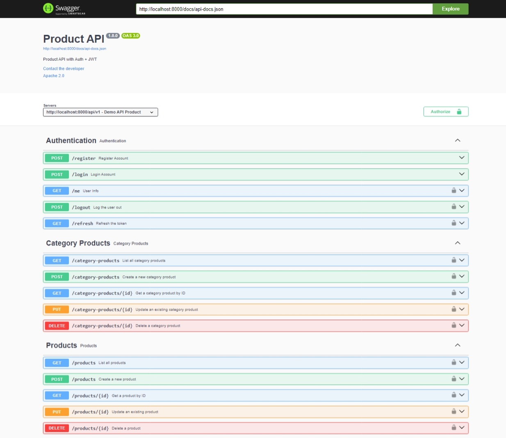

# Laravel Product API

## Overview

This project is a Laravel-based API focused on product management. It includes JWT authentication via `php-open-source-saver/jwt-auth` and API documentation using Swagger with `darkaonline/l5-swagger`.

## Features

-   **Product Management**: CRUD operations for managing products.
-   **JWT Authentication**: Secure access to the API using JSON Web Tokens.
-   **Swagger Documentation**: Auto-generated API documentation.

## Requirements

-   PHP 8.0+
-   Composer
-   Laravel 9.x
-   MySQL or another supported database

## Installation

### Step 1: Clone the Repository

```bash
git clone https://github.com/HadiatAbdulBashit/United-Tractor-Product-API.git
cd United-Tractor-Product-API
```

### Step 2: Install Dependencies

```bash
composer install
```

### Step 3: Set Up Environment Variables

Copy the `.env.example` file to `.env`:

```bash
cp .env.example .env
```

Update `.env` with your database credentials and JWT secret:

```env
APP_NAME=Laravel
APP_ENV=local
APP_KEY=base64:YOUR_APP_KEY
APP_DEBUG=true
APP_URL=http://localhost

DB_CONNECTION=mysql
DB_HOST=127.0.0.1
DB_PORT=3306
DB_DATABASE=your_database_name
DB_USERNAME=your_database_user
DB_PASSWORD=your_database_password

JWT_SECRET=your_jwt_secret_key
```

Generate the application key and JWT secret:

```bash
php artisan key:generate
php artisan jwt:secret
```

### Step 4: Run Migrations

```bash
php artisan migrate
```

### Step 5: Seed the Database (Optional)

```bash
php artisan db:seed
```

### Step 6: Serve the Application

```bash
php artisan serve
```

The application will be available at `http://localhost:8000`.

## API Documentation

### Swagger UI

Access the API documentation at:

```
http://localhost:8000/api/documentation
```

### Updating API Documentation

To regenerate the Swagger docs:

```bash
php artisan l5-swagger:generate
```

## Authentication

This project uses JWT for authentication. Obtain a token by registering or logging in a user.

## Example

For test this app please use swagger for easy test

